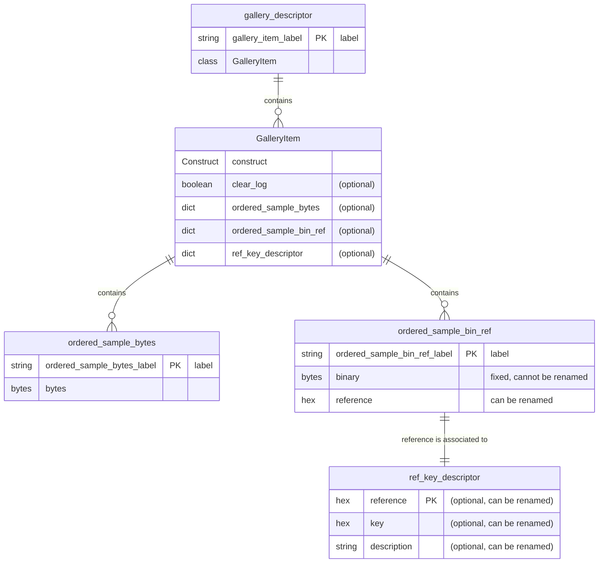
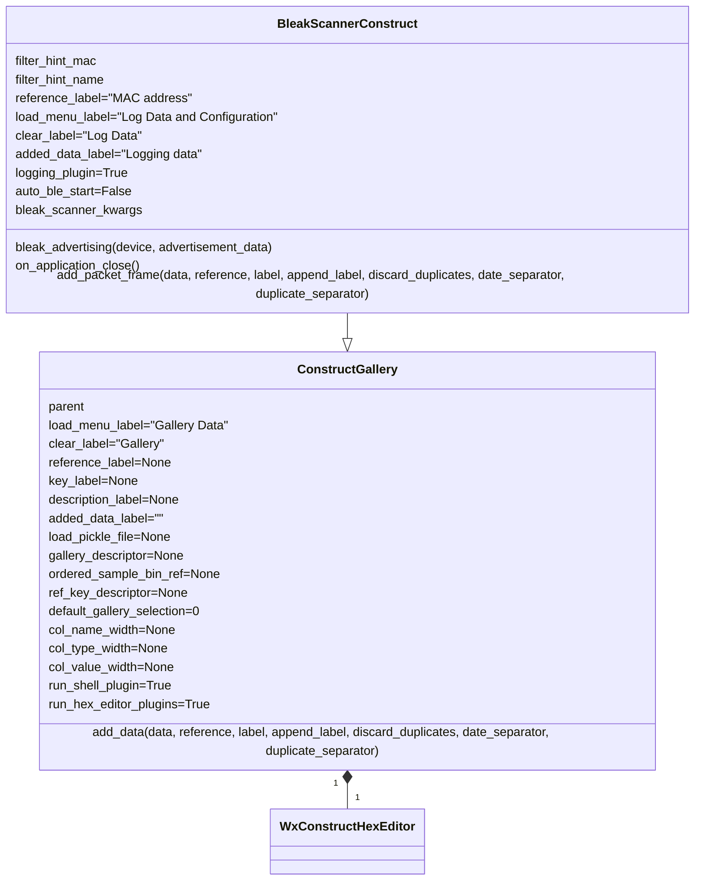
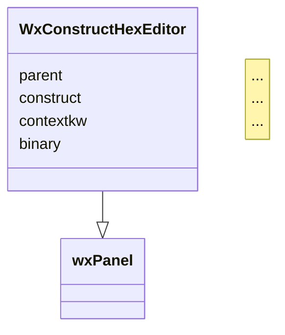
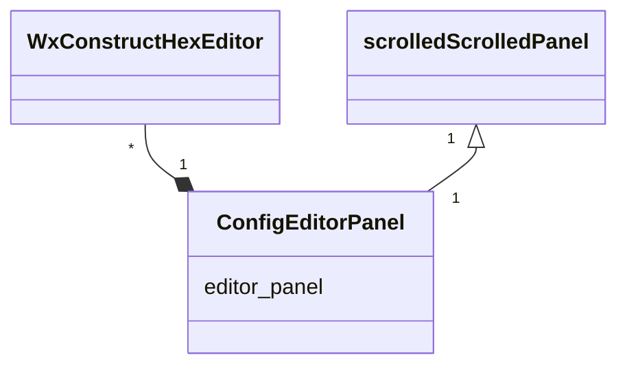

# construct-gallery

[](https://pypi.org/project/construct-gallery)
[](https://pypi.org/project/construct-gallery/)
[](https://pypi.python.org/pypi/construct-gallery/)
[](https://raw.githubusercontent.com/ircama/construct-gallery/master/LICENSE)

__Development and testing tool for construct, including widgets extending the functionalities of *construct-editor*__

*construct-gallery* is a GUI to interactively develop and test [construct](https://construct.readthedocs.io/en/latest/) data structures, dynamically parsing and building sample data which can be catalogued in an editable gallery and also stored in Pickle archives for later test re-execution. It also offers widgets that can be integrated in other Python programs.

The *construct* format shall be developed in a Python program through any IDE or editor. While editing and after loading the program to *construct-gallery*, it can be checked and also dynamically reloaded if modified meanwhile.

*construct-gallery* is based on [wxPython](https://www.wxpython.org/) and [construct-editor](https://github.com/timrid/construct-editor): specifically, it relies on the excellent editing widgets provided by the *construct-editor* module and offers a superset of features compared with its standard [GUI](https://github.com/timrid/construct-editor/blob/main/construct_editor/main.py).

## Main functionalities

- Ready-to-use, cross-platform GUI
- API widgets
- The tool allows to define a gallery of *construct* formats, optionally associated to samples, which can be dynamically added, edited or predefined.
- Hex bytes can be collected into a gallery of samples, then renamed and reordered.
- Samples are listed in the left panel, shown as hex bytes in the central panel and then parsed to browsable *construct* structures in the right panel.
- Data can be saved to files in [pickle format](https://docs.python.org/3/library/pickle.html). Archives can be subsequently reloaded and appended to the current samples. They can also be inspected with `python3 -mpickle archive-file-name.pickle`.
- The Python error management is wrapped into a GUI panel.
- A Python shell button allows to open an inspector shell, which also provides a special *Help* with related submenu (or by pressing F9).
- All panels allow a context menu (invoked with the right click of the mouse) with a number of special functions.
  - The left menu panel allows renaming labels and changing attribute labels. Also, by double-clicking an unused area of the left panel, new frames can be added and then labelled; subsequently, specific attributes can be associated. Samples can be repositioned, or deleted.
  - The hex editor (central panel) allows any kind of editing and copy/paste. Sequences of bytes can be pasted [in a number of different formats](https://github.com/timrid/construct-editor/pull/17#issuecomment-1367582581). Also, a special checkbox enables pasting Python expressions. Debugging tools are also provided (invoked with the right click of the mouse after selecting a sequence of bytes), to insert or convert bytes into a wide set of numeric forms as well as strings; these debug panels can be used to quickly check the most appropriate conversion method for a sequence of bytes.

When also *bleak* is installed, the GUI includes a BLE Advertisement monitoring tool. Advertisements are logged in their reception sequence, automatically labeled with related MAC address.

- A filter button can be used to enter a specific MAC address to restrict logging, a portion of it or a sequence of addresses, as well as BLE local names.
- When starting the BLE reception, a debug window is opened in background, with the possibility to control the debug level and clear the produced data.

## Example of basic usage

Save the following example program to a file named for instance *constr.py*:

```python
from construct import *

construct_format = Struct(
    "temperature" / Int16sl,
    "counter" / Int8ul
)
```

Load it with *construct-gallery*:

```bash
python3 -m construct_gallery constr.py
```

Paste the following bytes to the central hex panel of *construct-gallery*:

```
14 00 0c
```

You can use all the available tools of *construct-gallery* to edit the digits and test the results. Notice the various plugins that enrich the functionalities of *construct-editor*.

You can keep *construct-gallery* running while editing *constr.py* with your preferred editor or IDE; paste for instance the following code, replacing the previous one, then save:

```python
from construct import *
import construct_editor.core.custom as custom

custom.add_custom_adapter(ExprAdapter, "Int16ul_x100", custom.AdapterObjEditorType.String)
Int16ul_x100 = ExprAdapter(Int16ul, obj_ / 100, lambda obj, ctx: int(float(obj) * 100))

construct_format = GreedyRange(
    Struct(
        "temperature" / Int16ul_x100,
        "counter" / Int8ul,
    )
)
```

Note: when using [tunnels](https://construct.readthedocs.io/en/latest/api/adapters.html#construct.ExprAdapter), you also need to [declare the adapter](https://github.com/timrid/construct-editor/blob/b4c63dcea1a057cbcc7106b2d58c8bb4d8503e3b/construct_editor/core/custom.py#L53) for correct rendering in *construct-editor*.

Press "Reload construct module" in *construct-gallery*: you will see the updated structure.

Past the following bytes to the central hex panel of *construct-gallery*:

```
02 08 0c 70 08 0d de 08 0e 4c 09 0f ba 09 10
```

The appropriately parsed data will be available in the right panel of *construct-gallery*, where values can be edited, producing the dynamical update of the byte sequence in the central panel.

Select some bytes in the central panel, press the right key of the mouse: a context menu is shown, with a set of editing and debugging tools. 

## Advanced usage

Other than the previously described basic mode, *construct-gallery*  offers advanced configurations that allow you to predefine a gallery of samples with different formats and options. The data structure defined with *construct-gallery* can be used to provide optional attributes to the *construct* format.

*construct-gallery* is able to read two kinds of formats inside the Python program:

- the basic one, consisting of a single gallery element (the one previously exemplified):

  ```
  construct_format = <Construct structure>
  ```

- and a gallery of multiple elements:

  ```
  gallery_descriptor = <dictionary or ordered dictionary of GalleryItem elements>
  ```

Notice that *construct_format* and *gallery_descriptor* are default names of variables which can be changed through the `-f`/`-F` options, or via API (ref. *gallery_descriptor_var* and *construct_format_var* parameters of `ConstructGallery()`).

When using the *construct_format* mode, in order to provide basic structures for testing, *construct-gallery* automatically creates *Bytes*, *Characters* and *UTF-8 String* galleries (if you run the previous example, you can see them).

The *gallery_descriptor* mode allows you to define custom galleries. To classify the custom gallery elements, *gallery_descriptor* adopts an enriched `GalleryItem()` data model [initially defined in *construct-editor*](https://github.com/timrid/construct-editor/blob/b4c63dcea1a057cbcc7106b2d58c8bb4d8503e3b/construct_editor/gallery/__init__.py#L7-L10), which can be imported with `from construct_gallery import GalleryItem`.

The *gallery_descriptor* mode can be:

- a dictionary of `"item name": GalleryItem()` (*key: value* pairs). Example:

  ```python
  from construct_gallery import GalleryItem

  gallery_descriptor = {
      "Item 1": GalleryItem(
      ...
      ),
      "Item 2": GalleryItem(
      ...
      )
  }
  ```

- an ordered dictionary of `"item name": GalleryItem()` (*key: value* pairs). Example:

  ```python
  from construct_gallery import GalleryItem
  from collections import OrderedDict

  gallery_descriptor = (
      OrderedDict(
          [
              (
                  "Item 1",
                  GalleryItem(
                      ...
                  ),
              ),
              (
                  "Item 2",
                  GalleryItem(
                      ...
                  ),
              ),
          ]
      )
  )
  ```

As mentioned, *construct_gallery* enhances the *GalleryItem* data model, introducing additional attributes:

```python
import dataclasses
import typing as t

@dataclasses.dataclass
class GalleryItem:
    construct: "cs.Construct[t.Any, t.Any]"
    clear_log: bool = False
    contextkw: t.Dict[str, t.Any] = dataclasses.field(default_factory=dict)
    ordered_sample_bytes: t.OrderedDict[str, bytes] = dataclasses.field(default_factory=dict)
    ordered_sample_bin_ref: t.OrderedDict[str, dict] = dataclasses.field(default_factory=dict)
    ref_key_descriptor: t.Dict[str, dict] = dataclasses.field(default_factory=dict)
```

The `construct` attribute is mandatory and must be referred to a `construct` definition.

*GalleryItem* can collect `ordered_sample_bytes`, which is a dictionary or ordered dictionary of bytes; this is the simplest mode and consists of a collection of `"label": bytes` key-value pairs.

The `clear_log` attribute is optional: when set to `True`, all related samples are deleted each time a `construct` is changed in the gallery through the GUI; otherwise, new samples are added at the bottom of the sample list.

All other attributes available with *gallery_descriptor* (*contextkw*, *ordered_sample_bin_ref*, *ref_key_descriptor*) are described later.

Example of *GalleryItem* using the basic dictionary format of the `ordered_sample_bytes` samples:

```python
import construct as cs
from construct_gallery import GalleryItem

GalleryItem(
    construct=cs.Struct(
        "Int16ub" / cs.Int16ub,
        "Int8ub" / cs.Int8ub
    ),
    clear_log=True,
    ordered_sample_bytes={  # dictionary format
        "A number": bytes.fromhex("04 d2 7b"),
        "All 1": bytes.fromhex("00 01 01"),
        "All 0": bytes(2 + 1),
    },
)
```

Using the previously described *constr.py* example to test the *gallery_descriptor* format, paste the following code, then save:

```python
from collections import OrderedDict
from construct import *
import construct_editor.core.custom as custom
from construct_gallery import GalleryItem

custom.add_custom_adapter(ExprAdapter, "Int16ul_x100", custom.AdapterObjEditorType.String)
Int16ul_x100 = ExprAdapter(Int16ul, obj_ / 100, lambda obj, ctx: int(float(obj) * 100))

gallery_descriptor = {
    "Basic example": GalleryItem(
        construct=Struct(
            "temperature" / Int16sl,
            "counter" / Int8ul
        ),
        clear_log=True,
        ordered_sample_bytes={
            'Numbers 20 and 12': bytes.fromhex("14 00 0c"),
            'Numbers 21 and 13': bytes.fromhex("15 00 0d"),
        }
    ),
    "More complex example": GalleryItem(
        construct=GreedyRange(
            Struct(
                "temperature" / Int16ul_x100,
                "counter" / Int8ul,
            )
        ),
        clear_log=True,
        ordered_sample_bytes=OrderedDict(  # OrderedDict format
            [
                ('Ten numbers', bytes.fromhex(
                    "02 08 0c 70 08 0d de 08 0e 4c 09 0f ba 09 10")),
                ('All 1', bytes.fromhex(
                    "64 00 01 64 00 01 64 00 01 64 00 00 64 00 01")),
                ('All 0', bytes(8 + 4 + 2 + 1)),
            ]
        )
    ),
}
```

### Using keyword arguments

As `construct` accepts keyword arguments passed through the [`_params`](https://construct.readthedocs.io/en/latest/basics.html#hidden-context-entries) entry in order to provide metadata or additional information to the structure, also *construct-editor* and *construct-gallery* support them.

```python
# How construct uses keyword arguments:
from construct import *

constr = Struct(
    "my_counter" / Int8ul,
    'my_string' / Computed(this._params.my_string),
    'my_digit' / Computed(this._params.my_digit),
)

print(constr.parse(b'\x01', my_string="Hello", my_digit=2))
```
*construct-gallery* can use the same `contextkw` global form defined by *construct-editor*, or up to three variables (reference, key and description) inside each *GalleryItem*.

`contextkw` is a dictionary of "*key: value*" pairs of items to be passed to `construct` as arguments.

In the previous sample, the following produces the same result:

```python
contextkw = {
    'my_string': "Hello",
    'my_digit': 2,
}

print(constr.parse(b'\x01', **contextkw))  # dictionary unpack to keyword arguments
```

In the following example, *my_string* is directly used inside the *construct* format, while *decimals* is passed to *ExprAdapter*; both access these variables via the *_params* entry:

```python
from construct import *
import construct_editor.core.custom as custom
from construct_gallery import GalleryItem

custom.add_custom_adapter(ExprAdapter, "ExprAdapter", custom.AdapterObjEditorType.String)
Int16sl_Dec = ExprAdapter(
    Int16ul,
    lambda obj, ctx: obj / int(ctx._params.decimals),
    lambda obj, ctx: int(float(obj) * int(ctx._params.decimals))
)

gallery_descriptor = {
    "Basic example": GalleryItem(
        construct=Struct(
            "temperature" / Int16sl_Dec,
            "counter" / Int8ul,
            'my_string' / Computed(this._params.my_string),
        ),
        clear_log=True,
        ordered_sample_bytes={
            'Numbers 20.5 and 12': bytes.fromhex("14 50 0c"),
            'Numbers 21.4 and 13': bytes.fromhex("98 53 0d"),
        },
        contextkw={
            'my_string': "one",
            'decimals': 1000,
        }
    )
}
```

In the previous form, which uses the *ordered_sample_bytes* attribute, the keywords defined in *contextkw* are globally available for all samples of the *GalleryItem*.

In addition, *construct_gallery* allows using the *ordered_sample_bin_ref* attribute, which associates a reference (see "reference" in the following example, with customizable key label) to each byte sequence("binary", fixed key):

```python
from collections import OrderedDict

ordered_sample_bin_ref=OrderedDict(
    [
        (
            "One",
            {
                "binary": b'\x00\x01',
                "reference": "AA",
            },
        ),
        (
            "Two",
            {
                "binary": b'\x00\x02',
                "reference": "BB",
            },
        ),
    ]
)
```

Each reference can be mapped to other two values through the `ref_key_descriptor` attribute:

```python
ref_key_descriptor={
    "AA": {
        "key": "aaaaaaaa",
        "description": "first",
    },
    "BB": {
        "key": "bbbbbbbb",
        "description": "second",
    }
}
```

All these three values (reference, key, description) are available through the *_params* entry and their labels must be preliminarily set using `-R`, `-K` and `-D` options, or using the *reference_label*, *key_label* and *description_label* parameters of the *ConstructGallery()* API. All are strings. *reference* and *key* shall be only valued with hex values. *description* allows free format.

Specifically, `-R` (*reference_label*) is always mandatory. `-K` and `-D`(*key_label* and *description_label*) are required when key and description values are also needed. As an example, the first might be mapped to the MAC address, the second to an encryption hex string and the third to an optional description text.

The following is a typical structure of the *gallery_descriptor* variable when using *ordered_sample_bin_ref* and *ref_key_descriptor* in *GalleryItem()*:

```python
from collections import OrderedDict
from construct_gallery import GalleryItem

gallery_descriptor = {
    "item": GalleryItem(
        construct=...,
        clear_log=True,
        ordered_sample_bin_ref=OrderedDict(
            ...
        ),
        ref_key_descriptor={
            ...
        }
    ),
    ...: ...,
}
```

`ordered_sample_bin_ref` is an ordered dictionary of ordered dictionaries; the form is a collection of `"label": dict_item` key-value elements, where *dict_item* is in turn a collection of `"binary": bytes, "reference": string` elements. The key *"binary"* is fixed. The label *reference* can be customized through the *reference_label* parameter; for instance `reference_label="MAC address"`.

`ref_key_descriptor` is a dictionary of *"reference": { key, description }*.

In `ref_key_descriptor`, the actual name of "key" is determined by the `key_label` parameter, by substituting spaces with underscores and uppercase letters with lowercase. Examples: if `key_label="Bindkey"`, then the key will be `"bindkey"`. If `reference_label="MAC address"`, then the reference will be `"mac_address"`. Same for the *description* label (ref. `description_label`).

When using the API, the *gallery_descriptor* parameter is used to load the related structure; in addition, *ordered_sample_bin_ref* and *ref_key_descriptor* are available to separately load *ordered_sample_bin_ref* and *ref_key_descriptor* data, if *gallery_descriptor* does not include them.

The following diagram describes the relationship among the various attributes:



Using the previously described *constr.py* example to test the advanced usage of the *gallery_descriptor* format, paste the following code, then save:

```python
from collections import OrderedDict
from construct import *
import construct_editor.core.custom as custom
from construct_gallery import GalleryItem

custom.add_custom_adapter(ExprAdapter, "ExprAdapter", custom.AdapterObjEditorType.String)
Int16sl_Dec = ExprAdapter(
    Int16ul,
    lambda obj, ctx: obj / int(ctx._params.decimals),
    lambda obj, ctx: int(float(obj) * int(ctx._params.decimals))
)

gallery_descriptor = {
    "ordered_sample_bytes using dictionaries": GalleryItem(
        construct=Struct(
            "temperature" / Int16sl_Dec,
            "counter" / Int8ul,
            'my_string' / Computed(this._params.my_string),
            'decimals' / Computed(this._params.decimals),
        ),
        clear_log=True,
        ordered_sample_bytes={
            'Numbers 20.5 and 12': bytes.fromhex("14 50 0c"),
            'Numbers 21.4 and 13': bytes.fromhex("98 53 0d"),
        },
        contextkw={
            'my_string': "one",
            'decimals': 1000,
        }
    ),
    "ordered_sample_bytes using ordered dictionaries": GalleryItem(
        construct=GreedyRange(
            Struct(
                "temperature" / Int16sl_Dec,
                "counter" / Int8ul,
            )
        ),
        clear_log=True,
        ordered_sample_bytes=OrderedDict(  # OrderedDict format
            [
                ('Ten numbers', bytes.fromhex(
                    "cd 00 0c d8 00 0d e3 00 0e ee 00 0f f9 00 10")),
                ('All 1', bytes.fromhex(
                    "64 00 01 64 00 01 64 00 01 64 00 01 64 00 01")),
                ('All 0', bytes(8 + 4 + 2 + 1)),
            ]
        ),
        contextkw={
            'decimals': 10,
        }
    ),
    "ordered_sample_bin_ref": GalleryItem(
        construct=GreedyRange(
            Struct(
                "temperature" / Int16sl_Dec,
                "counter" / Int8ul,
                'key' / Computed(this._params.key),
                'reference' / Computed(this._root._.reference),
                'decimals' / Computed(this._params.decimals)
            )
        ),
        clear_log=True,
        ordered_sample_bin_ref=OrderedDict(
            [
                (
                    "Ten numbers",
                    {
                        "binary": bytes.fromhex("34 0a 11 a3 0a 12 12 0b 13 81 0b 14 f0 0b 15"),
                        "reference": "AA:BB:CC:DD:EE:FF",
                    },
                ),
                (
                    "All 2",
                    {
                        "binary": bytes.fromhex("c8 00 02 c8 00 02 c8 00 02 c8 00 02 c8 00 02"),
                        "reference": "AA:BB:CC:DD:EE:FF",
                    },
                ),
                (
                    "All 3",
                    {
                        "binary": bytes.fromhex("1e 00 03 1e 00 03 1e 00 03 1e 00 03 1e 00 03"),
                        "reference": "00:11:22:33:44:55",
                    },
                ),
            ]
        ),
        ref_key_descriptor={
            "AA:BB:CC:DD:EE:FF": {
                "key": "aaaaaaaa",
                "decimals": "100",
            },
            "00:11:22:33:44:55": {
                "key": "bbbbbbbb",
                "decimals": "10",
            }
        }
    ),
}
```

Run it with the following command:

```bash
python3 -m construct_gallery -R reference -K key -D decimals constr.py
```

Verify all buttons.

## Command-line parameters

```
usage: construct_gallery [-h] [-R--reference_label REFERENCE_LABEL] [-K KEY_LABEL] [-D DESCRIPTION_LABEL] [-M] [-m] [-g]
                         [-F GALLERY_DESCRIPTOR_VAR] [-f CONSTRUCT_FORMAT_VAR] [-b] [-c]
                         [CONSTRUCT_MODULE]

Run as python3 -m construct_gallery ...

positional arguments:
  CONSTRUCT_MODULE      construct Python module pathname.

options:
  -h, --help            show this help message and exit
  -R--reference_label REFERENCE_LABEL
                        "reference_label" string.
  -K KEY_LABEL, --key_label KEY_LABEL
                        "key_label" string
  -D DESCRIPTION_LABEL, --description_label DESCRIPTION_LABEL
                        "description_label" string.
  -M, --not_detect_svc_data
                        Only used with -b/--bleak option. Do not detect service data with -b option and detect manufacturer data. Default
                        is to detect service data and not to detect manufacturer data.
  -m, --detect_manuf_data
                        Only used with -b/--bleak option. Detect both manufacturer and service data with -b option. Default is not to
                        detect manufacturer data and only detect service data.
  -g, --gallery         ConstructGallery demo (default)
  -F GALLERY_DESCRIPTOR_VAR, --gallery_descriptor GALLERY_DESCRIPTOR_VAR
                        Custom "gallery_descriptor" variable name.
  -f CONSTRUCT_FORMAT_VAR, --construct_format CONSTRUCT_FORMAT_VAR
                        Custom "construct_format" variable name.
  -b, --bleak           BleakScannerConstruct test app.
  -c, --config          ConfigEditorPanel demo.

construct_gallery utility
```

Parameters `-b` with related `-m` and `-M` are only available when *bleak* is installed.

Error exit codes:

2: invalid command line parameter

## Modules and widgets

The following Python modules are included:

- `construct_gallery.py`, providing the `ConstructGallery()` class.

  This module implements a GUI editor to parse and build an editable and ordered list of binary data via a gallery of predefined [construct](https://construct.readthedocs.io/en/latest/) data structures.
  
  *construct* is a powerful, declarative, symmetrical parser and builder for binary data.
  
  `construct_gallery.py` is based on [wxPython](https://www.wxpython.org/) and [construct-editor](https://github.com/timrid/construct-editor): it relies on the excellent editing widgets provided by the *construct-editor* module and offers a superset of features compared with its standard [GUI](https://github.com/timrid/construct-editor/blob/main/construct_editor/main.py).
  
  This module can be directly used in GUI programs, or can be further extended with `bleak_scanner_construct.py`.

- `config_editor.py`, providing the `ConfigEditorPanel()` class (widget).

  This widget implements an editing GUI composed by a form including multiple byte structures, each one related to its own *construct* data model.
  
  The structure of this form is described by the "editing_structure" parameter.

- `bleak_scanner_construct.py`, providing the `BleakScannerConstruct()` class.

  The component implements a [Bluetooth Low Energy](https://en.wikipedia.org/wiki/Bluetooth_Low_Energy) (BLE) GUI client to log, browse, test and edit [BLE advertisements](https://en.wikipedia.org/wiki/Bluetooth_Low_Energy#Advertising_and_discovery).
  
  This module extends `construct_gallery.py`, offering a skeleton of BLE Advertiser scanner.
  
  [bleak](https://bleak.readthedocs.io/en/latest/) is needed (`pip3 install bleak`)

*construct-gallery* also includes a number of *construct-editor* plugins, which are used by `ConstructGallery()` and `BleakScannerConstruct()`, but they can be separately reused on projects based on *construct-editor*.

- plugins offering additional options for the context menu of the *construct-editor* HexEditorGrid (invoked with the right click of the mouse):
  - `allow_python_expr_plugin.py`
  - `decimal_convert_plugin.py`
  - `string_convert_plugin.py`
- `wx_logging_plugin.py`, providing a debug GUI panel in background.
- `pyshell_plugin.py`, activating a Python shell button that allows opening a PyShell frame (PyShell is a GUI-based python shell), which also includes a special *Help* with related submenu (that can be invoked also via F9). 
- `edit_plugin.py`, enabling "Edit UTF-8 text" and "Edit bytes" options on the context-menu of the central hex editor panel.

## Setup

### Installation

Check that the [Python](https://www.python.org/) version is 3.8 or higher (`python3 -V`), then install *construct-gallery* with the following command:

```shell
python3 -m pip install construct-gallery
```

If the `bleak_scanner_construct.py` BLE module is also needed:

```shell
python3 -m pip install bleak
```

With Raspberry Pi, *bleak* will install *dbus-fast*, which needs to build the python *wheel* (related compilation takes some time).

Prerequisite component: [construct-editor](https://github.com/timrid/construct-editor). *construct-editor* is automatically installed with the package, while *bleak* requires manual installation.

Additional prerequisites for Raspberry Pi:

```
sudo apt-get install -y libgtk-3-dev
python3 -m pip install attrdict
```

With Python 3.11 replace *attrdict* with *attrdict3*:

```
python3 -m pip uninstall attrdict
python3 -m pip install attrdict3
```

The C compiler is needed too.

Alternatively to the above-mentioned installation method, the following steps allow installing the latest version from GitHub.

- Optional preliminary configuration (if not already done):

  ```shell
  # Install Python anf Git
  sudo apt-get update
  sudo apt-get -y upgrade
  sudo add-apt-repository universe # this is only needed if "sudo apt install python3-pip" fails
  sudo apt-get update
  sudo apt install -y python3-pip
  python3 -m pip install --upgrade pip
  sudo apt install -y git
  ```

- Run this command to install *construct-gallery* from GitHub:

```shell
  python3 -m pip install git+https://github.com/Ircama/construct-gallery
```

To uninstall:

```shell
python3 -m pip uninstall -y construct-gallery
```

## API Documentation

### ConstructGallery

```python
import wx
from construct_gallery import ConstructGallery

frame = wx.Frame()
...

cg = ConstructGallery(
    frame,                           # Parent frame
    load_menu_label="Gallery Data",  # Label of the clear samples button
    clear_label="Gallery",           # Label of the clear gallery button

    reference_label=None,    # Needed reference label when using ordered_sample_bin_ref in GalleryItem
    key_label=None,          # Key label when using ordered_sample_bin_ref
    description_label=None,  # Description label when using ordered_sample_bin_ref

    added_data_label="",          # Label of an optional trailer to each added record
    load_pickle_file=None,        # Pickle file to be loaded at startup

    gallery_descriptor=None,      # gallery_descriptor parameter (see below)
    ordered_sample_bin_ref=None,  # ordered_sample_bin_ref variable, when non included in gallery_descriptor
    ref_key_descriptor=None,      # ref_key_descriptor variable, when non included in gallery_descriptor

    default_gallery_selection=0,  # Number of the selected element in the construct gallery

    gallery_descriptor_var=None,  # Name of the searched gallery_descriptor variable in the imported program (default is "gallery_descriptor")
    construct_format_var=None,    # Name of the searched construct_format variable in the imported program (default is "construct_format")

    col_name_width=None,          # Width of the first column ("name")
    col_type_width=None,          # Width of the second column ("type")
    col_value_width=None,         # Width of the third column ("value"),

    run_shell_plugin=True,        # Activate the shell plugin by default
    run_hex_editor_plugins=True   # Activate the hex editor plugins by default
)
...
```

The *gallery_descriptor* parameter can be:

- a module (including *construct_format* or *gallery_descriptor*), which is imported at runtime; the button "Reload construct module" appears in this case, to enable the dynamic reloading of the module;
- a variable (either a simple *construct* form or a *gallery_descriptor* form).

Other than adding *ordered_sample_bin_ref* and *ref_key_descriptor* to each *GalleryItem* of *gallery_descriptor*, they can be separately and globally set with the *ordered_sample_bin_ref* and *ref_key_descriptor parameters* of ConstructGallery():

- `ordered_sample_bin_ref` is an ordered dictionary (`OrderedDict`) of samples that are valid for all construct gallery elements, so independent of specific elements in the *gallery_descriptor*. Notice that, if a reference is used, *reference_label*, *key_label* and *description_label* must be set in *ConstructGallery*.
- `ref_key_descriptor` is a dictionary of key and descriptor for each reference. This is valid for all construct gallery elements.

Another possibility to load the configuration (or to replace a default configuration) is through a Pickle file created by the "Save to file" button of *construct_gallery*; use *load_pickle_file* for this.

Complete program:

```python
import wx
import construct as cs
from construct_gallery import ConstructGallery, GalleryItem
from collections import OrderedDict

app = wx.App(False)
frame = wx.Frame(
    None, title="ConstructGalleryFrame", size=(1000, 600))
frame.CreateStatusBar()

gallery_descriptor = {
    "Signed little endian int (16, 8)": GalleryItem(
        construct=cs.Struct(
            "Int16sl" / cs.Int16sl,
            "Int8sl" / cs.Int8sl
        ),
        clear_log=True,
        ordered_sample_bytes=OrderedDict(  # OrderedDict format
            [
                ('A number', bytes.fromhex("01 02 03")),
                ('All 1', bytes.fromhex("01 00 01")),
                ('All 0', bytes(2 + 1)),
            ]
        )
    ),
    "Unsigned big endian int (16, 8)": GalleryItem(
        construct=cs.Struct(
            "Int16ub" / cs.Int16ub,
            "Int8ub" / cs.Int8ub
        ),
        clear_log=True,
        ordered_sample_bytes={  # dictionary format
            "A number": bytes.fromhex("04 d2 7b"),
            "All 1": bytes.fromhex("00 01 01"),
            "All 0": bytes(2 + 1),
        },
    )
}

ConstructGallery(frame, gallery_descriptor=gallery_descriptor)
frame.Show(True)
app.MainLoop()
```

### construct-gallery package



### construct-editor package



### ConfigEditorPanel

This widget implements an editing GUI composed by a form including multiple structures, each one related to its own *construct* data model. All is described by the "editing_structure" dictionary.

The object returned by "ConfigEditorPanel" can be used to read the edited structure via the included "editor_panel" array, like with the following:

```python
from construct_gallery import ConfigEditorPanel
...
config_editor_panel = ConfigEditorPanel(...)
...
app.MainLoop()

for char in config_editor_panel.editor_panel:
    print("Edited value:", config_editor_panel.editor_panel[char].binary)
```

Test it with `python3 -m construct_gallery -c`.

The example below also describes the data model of the "editing_structure" structure.

```python
import wx
from construct_gallery import ConfigEditorPanel
from construct_editor.core.model import IntegerFormat
import construct as cs

editing_structure = {
    0: {  # This must be numeric; multiple numbers can be included. The word "Characteristic 0" is written to the left side, as the first line.
        "name": "A string",  # The bold name "A string" is written to the left side, as the second line.
        "binary": b"My string",  # the "bytes" window is hidden by the fault and can be expanded through the GUI
        "construct": cs.Struct(
            "My string" / cs.GreedyString("utf8"),
        ),
        "read_only": True,  # (boolean) False or True. If True, "(read only)" is written to the left side, as the third line.
        "size": 130,  # Number of vertical pixels to show (if smaller than the minimum requested size, a scroll bar appears).
        "IntegerFormat": IntegerFormat.Hex,  # Default format for integers: IntegerFormat.Hex or IntegerFormat.Dec
    },
}

app = wx.App(False)
frame = wx.Frame(
    None, title="ConfigEditorPanelFrame demo", size=(1000, 300))
frame.CreateStatusBar()
main_panel = ConfigEditorPanel(
    frame,
    editing_structure=editing_structure,
    name_size=180,
    type_size=160,
    value_size=200
)
frame.Show(True)
app.MainLoop()
for char in main_panel.editor_panel:
    editing_structure[char][
        "new_binary"] = main_panel.editor_panel[char].binary
for i in editing_structure:
    print(i, editing_structure[i])
```



### BleakScannerConstruct

Test it with `python3 -m construct_gallery -b`.

```python
from construct_gallery import BleakScannerConstruct

bc = BleakScannerConstruct(
    frame,
    filter_hint_mac=None,
    filter_hint_name=None,
    reference_label="MAC address",
    load_menu_label="Log Data and Configuration",
    clear_label="Log Data",
    added_data_label="Logging data",
    logging_plugin=True,
        #  (same arguments as ConstructGallery)
)
```

Optionally, `bleak_scanner_kwargs` allows defining a dictionary of arguments passed to *BleakScanner* in the form: `BleakScanner(detection_callback, **bleak_scanner_kwargs)`.

The intended way to use this class is to create a subclass that overrides the *bleak_advertising()* method (which does nothing in the parent class). The overridden method shall detect valid advertisements and call `self.add_packet_frame()` to log data to the gallery samples of *construct-gallery*. *logging* can be used to log debugging information to *wx_logging_plugin*.

Example:

```python
from construct_gallery import BleakScannerConstruct
import logging


class MyScanner(BleakScannerConstruct):
    def bleak_advertising(self, device, advertisement_data):
        format_label = ...get_label_from...advertisement_data
        adv_data = ...get_adv_data_from...advertisement_data
        error = ...get_error_from...advertisement_data
        if error:
            logging.warning(
                "mac: %s. %s advertisement: %s. RSSI: %s",
                device.address, format_label, advertisement_data, device.rssi)
            return
        if adv_data:
            self.add_packet_frame(
                data=adv_data,
                reference=device.address,
                append_label=format_label
            )
        logging.info(
            "mac: %s. %s advertisement: %s. RSSI: %s",
            device.address, format_label, advertisement_data, device.rssi)
```

*BleakScannerConstruct* does all the logic to perform asynchronous processing of BLE advertising via the *BleakScanner* method of BLE, including the management of a thread which can be started and stopped through GUI buttons. *add_packet_frame()* calls *add_data()* of *construct-gallery*.

```python
bleak_advertising(self, device, advertisement_data)
```

- device: [BLEDevice](https://bleak.readthedocs.io/en/latest/api/index.html?highlight=BLEDevice#bleak.backends.device.BLEDevice) and related [source code](https://bleak.readthedocs.io/en/latest/_modules/bleak/backends/device.html?highlight=BLEDevice#)
- advertisement_data: [AdvertisementData](https://bleak.readthedocs.io/en/latest/backends/index.html?highlight=AdvertisementData#bleak.backends.scanner.AdvertisementData) and related [source code](https://bleak.readthedocs.io/en/latest/_modules/bleak/backends/scanner.html)

Complete BLE logger program.

```python
import wx
import logging
import construct as cs
from construct_gallery import GalleryItem, BleakScannerConstruct

adv_format = cs.Struct(
    "type" / cs.Int8ub,
    "length" / cs.Int8ub,
    "bytes" / cs.Array(cs.this.length, cs.Byte),
)

class BleConstruct(BleakScannerConstruct):
    def bleak_advertising(self, device, advertisement_data):
        try:
            adv_data = advertisement_data.manufacturer_data[0x004C]
            ibeacon = adv_format.parse(adv_data)
            self.add_packet_frame(
                data=adv_data,
                reference=device.address
            )
        except Exception:
            logging.warning(
                "mac: %s. advertisement: %s. RSSI: %s",
                device.address, advertisement_data, device.rssi)

app = wx.App(False)
frame = wx.Frame(
    None, title="BleakScannerConstructFrame", size=(1000, 600)
)
frame.CreateStatusBar()
BleConstruct(
    frame,
    gallery_descriptor = {"advertisements": GalleryItem(construct=adv_format)}
)
frame.Show(True)
app.MainLoop()
```

## Plugins

- plugins offering additional options for the context menu of the *construct-editor* HexEditorGrid (invoked with the right click of the mouse):
  - `allow_python_expr_plugin.py`
  - `decimal_convert_plugin.py`
  - `string_convert_plugin.py`

- PyShell plugin `pyshell_plugin.py`, adding a button to activate a PyShell frame (PyShell is a GUI-based python shell).

- `wx_logging_plugin.py`, providing a debug GUI panel in background.
- `pyshell_plugin.py`, activating a Python shell button that allows opening an inspector shell, which also includes a special *Help* with related submenu (that can be invoked also via F9). 

The following example shows how to add the first three plugins to *HexEditorGrid*. It is based on the [Getting started (as Widgets)](https://github.com/timrid/construct-editor#getting-started-as-widgets) of the *construct-editor* module:

```python
import wx
import construct as cs
from construct_editor.wx_widgets import WxConstructHexEditor
import construct_editor.wx_widgets.wx_hex_editor

from construct_gallery import decimal_convert_plugin
from construct_gallery import string_convert_plugin
from construct_gallery import allow_python_expr_plugin


class HexEditorGrid(  # add plugins to HexEditorGrid
        string_convert_plugin.HexEditorGrid,
        decimal_convert_plugin.HexEditorGrid,
        allow_python_expr_plugin.HexEditorGrid,
        construct_editor.wx_widgets.wx_hex_editor.HexEditorGrid):
    def build_context_menu(self):
        menus = super().build_context_menu()
        menus.insert(-3, None)  # add a horizontal line before the two plugins
        return menus


constr = cs.Struct(
    "a" / cs.Int16sb,
    "b" / cs.Int16sb,
)
b = bytes([0x12, 0x34, 0x56, 0x78])

# monkey-patch HexEditorGrid
construct_editor.wx_widgets.wx_hex_editor.HexEditorGrid = HexEditorGrid

app = wx.App(False)
frame = wx.Frame(None, title="Construct Hex Editor", size=(1000, 200))
editor_panel = WxConstructHexEditor(frame, construct=constr, binary=b)
frame.Show(True)
app.MainLoop()
```

The following example shows all plugins, including a way to close the *PyShellPlugin* when the application terminates:

```python
import wx
import construct as cs
from construct_editor.wx_widgets import WxConstructHexEditor
import construct_editor.wx_widgets.wx_hex_editor
import logging

from construct_gallery import decimal_convert_plugin
from construct_gallery import string_convert_plugin
from construct_gallery import allow_python_expr_plugin

from construct_gallery.pyshell_plugin import PyShellPlugin
from construct_gallery.wx_logging_plugin import WxLogging


class HexEditorGrid(  # add plugins to HexEditorGrid
        string_convert_plugin.HexEditorGrid,
        decimal_convert_plugin.HexEditorGrid,
        allow_python_expr_plugin.HexEditorGrid,
        construct_editor.wx_widgets.wx_hex_editor.HexEditorGrid):
    def build_context_menu(self):
        menus = super().build_context_menu()
        menus.insert(-3, None)  # add a horizontal line before the two plugins
        return menus


class ConstHexEditorPanel(wx.Panel, PyShellPlugin):
    def __init__(self, *args, **kwargs):
        super().__init__(*args, **kwargs)

        sizer = wx.BoxSizer(wx.HORIZONTAL)  # it includes 3 vert. sizers

        vsizer = wx.BoxSizer(wx.VERTICAL)  # left side sizer
        self.py_shell(vsizer)  # Start PyShell plugin
        sizer.Add(vsizer, 0, wx.ALL | wx.EXPAND, 2)

        # monkey-patch HexEditorGrid
        construct_editor.wx_widgets.wx_hex_editor.HexEditorGrid = HexEditorGrid

        constr = cs.Struct(
            "a" / cs.Int16sb,
            "b" / cs.Int16sb,
        )
        b = bytes([0x12, 0x34, 0x56, 0x78])
        
        construct_hex_editor = WxConstructHexEditor(self, construct=constr, binary=b)
        sizer.Add(construct_hex_editor, 1, wx.ALL | wx.EXPAND, 2)
        self.SetSizer(sizer)
        self.wx_log_window = WxLogging(self, logging.getLogger())
        logging.warning("Hello World")


    def on_close(self, event):
        if hasattr(self, 'pyshell') and self.pyshell:
            self.pyshell.Destroy()
        event.Skip()


app = wx.App(False)
frame = wx.Frame(None, title="Construct Hex Editor", size=(1000, 200))
main_panel = ConstHexEditorPanel(frame)
frame.Bind(wx.EVT_CLOSE, main_panel.on_close)
frame.Show(True)
app.MainLoop()
```

## Installing wxPython with Python 3.11 on Windows

At the moment of writing, the [Python wheel packaging](https://packaging.python.org/en/latest/guides/distributing-packages-using-setuptools/#wheels) of wxPython for Python 3.11 is not yet available in [Pypi](https://pypi.org/). Follow this procedure to perform manual installation on Windows.

As a prerequisite, if not already installed, you might need to install the
[Visual C++ Redistributable for Visual Studio 2015](https://www.microsoft.com/en-us/download/details.aspx?id=48145). Example:

```cmd
curl "https://download.microsoft.com/download/9/3/F/93FCF1E7-E6A4-478B-96E7-D4B285925B00/vc_redist.x64.exe" --output vc_redist.x64.exe
```

Then run `vc_redist.x64.exe` and follow the installation steps.

Download the right WHL of wxPython from the related [Windows artifacts](https://dev.azure.com/oleksis/wxPython/_build/results?buildId=132&view=artifacts&pathAsName=false&type=publishedArtifacts):

Example:

```cmd
curl https://artprodcca1.artifacts.visualstudio.com/A09e3854d-7789-4d94-8809-7e11120c1549/40d5fac0-3bcd-4754-be87-d3ce7214bec4/_apis/artifact/cGlwZWxpbmVhcnRpZmFjdDovL29sZWtzaXMvcHJvamVjdElkLzQwZDVmYWMwLTNiY2QtNDc1NC1iZTg3LWQzY2U3MjE0YmVjNC9idWlsZElkLzEzMi9hcnRpZmFjdE5hbWUvd3hQeXRob24tcHkzLjExLXdpbl94NjQ1/content?format=zip --output wxPython-py3.11-win_x64.zip
powershell -command "Expand-Archive -LiteralPath wxPython-py3.11-win_x64.zip -DestinationPath wxPython-py3.11-win_x64"
```

Install wxPython WHL with the same syntax of installing a standard package:

```cmd
pip install wxPython-py3.11-win_x64\wxPython-py3.11-win_x64\wxPython-4.2.1a1-cp311-cp311-win_amd64.whl
```

# Preview

Preview of a sample usage of *construct_gallery* with all plugins:


Preview of a sample usage of *ConfigEditorPanel*:


<!---
INTERNAL NOTES HERE
- Rileggere il readme della parte API
- Aggiungere il readme dell'opzione -b
- C'è una nota: Test it with `python3 -m construct_gallery -c`.
- update mermaid
- scrivere che per editare basta inserire i numeri
- controllare quale parte del readme estrae il setup
"
-->
