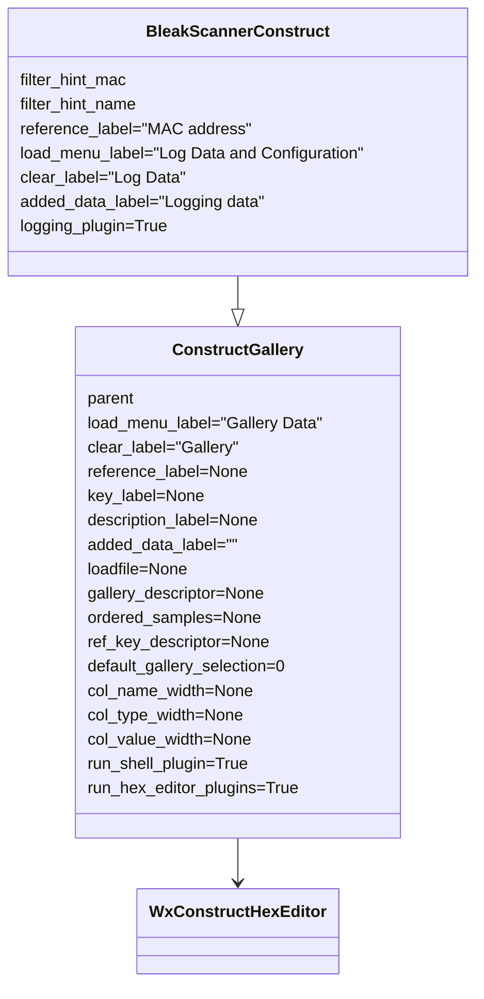
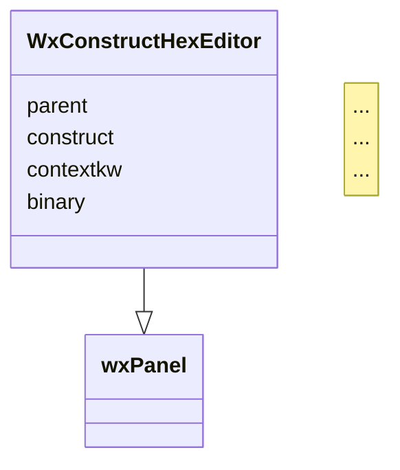

# construct-gallery

__wxPython Widgets extending functionalities of *construct-editor*__

The following Python modules are included:

- `construct_gallery.py`, providing the `ConstructGallery()` class.

  This module implements a GUI editor to parse and build an editable and ordered list of binary data via a gallery of predefined [construct](https://construct.readthedocs.io/en/latest/) data structures.
  
  *construct* is a powerful, declarative, symmetrical parser and builder for binary data.
  
  `construct_gallery.py` is based on [wxPython](https://www.wxpython.org/) and [construct-editor](https://github.com/timrid/construct-editor): it relies on the excellent editing widgets provided by the *construct-editor* module and offers a superset of features compared with its standard [GUI](https://github.com/timrid/construct-editor/blob/main/construct_editor/main.py).
  
  This module can be directly used in GUI programs, or can be further extended with `bleak_scanner_construct.py`.

- `bleak_scanner_construct.py`, providing the `BleakScannerConstruct()` class.

  The component implements a [Bluetooth Low Energy](https://en.wikipedia.org/wiki/Bluetooth_Low_Energy) (BLE) GUI client to log, browse, test and edit [BLE advertisements](https://en.wikipedia.org/wiki/Bluetooth_Low_Energy#Advertising_and_discovery).
  
  This module extends `construct_gallery.py`, offering a skeleton of BLE Advertiser scanner.
  
  [bleak](https://bleak.readthedocs.io/en/latest/) is needed (`pip3 install bleak`)

*construct-gallery* also includes a number of *construct-editor* plugins, which are used by `ConstructGallery()` and `BleakScannerConstruct()`, but they can be separately reused on projects based on *construct-editor*.

- plugins offering additional options for the context menu of the *construct-editor* HexEditorGrid (invoked with the right click of the mouse):
  - `allow_python_expr_plugin.py`
  - `decimal_convert_plugin.py`
  - `string_convert_plugin.py`

- PyShell plugin `pyshell_plugin.py`, adding a button to activate a PyShell frame (PyShell is a GUI-based python shell).

- `wx_logging_plugin.py`, providing a debug GUI panel in background.
- `pyshell_plugin.py`, activating a Python shell button that allows opening an inspector shell, which also includes a special *Help* with related submenu (that can be invoked also via F9). 

## Main functionalities

- Cross-platform GUI
- The GUI includes a BLE control (implemented with buttons) which allows starting and stopping the BLE advertising receiver. Advertisements are logged in their reception sequence, automatically labbelled with the MAC address.
- A filter button can be used to enter a specific MAC address to restrict logging, a portion of it or a sequence of addresses, as well as BLE local names.
- Logged data can be saved to file in [pickle format](https://docs.python.org/3/library/pickle.html). Archives can be subsequently reloaded and appended to the current log. They can also be inspected with `python -mpickle archive-file-name.pickle`.
- Advertisement data are logged in the left panel, shown as hex bytes in the central panel and then parsed to browsable *construct* structures in the right panel.
- The Python error management is wrapped into a GUI panel.
- A Python shell button allows opening an inspector shell, which also provides a special *Help* with related submenu (or by pressing F9).
- All panels allow a context menu (invoked with the right click of the mouse) with a number of special functions.
  - The left log menu panel allows renaming labels and changing MAC address. Also, by double clicking an unused area of the log panel, new frames can be added and then labelled; subsequently, a specific MAC address can be associated. Log elements can be repositioned, or deleted.
  - The hex editor (central panel) allows any kind of copy/paste. Sequences of bytes can be pasted [in a number of different formats](https://github.com/timrid/construct-editor/pull/17#issuecomment-1367582581). Also a special checkbox enables pasting Python expressions. Two debugging tools are also provided (invoked with the right click of the mouse after selecting a sequence of bytes), to convert bytes into a wide set of numeric forms as well as strings; these debug panels can be used to quickly check the most appropriate conversion method for a sequence of bytes.
- When starting the BLE reception, a debug window is opened in background, with the possibility to control the debug level and clear the produced data.

## Setup

### Installation

Check that the [Python](https://www.python.org/) version is 3.8 or higher (`python3 -V`), then install *construct-gallery* with the following command:

```shell
python3 -m pip install construct-gallery
```

If the `bleak_scanner_construct.py` BLE module is also needed:

```shell
python3 -m pip install bleak
```

Prerequisite component: [construct_editor](https://github.com/timrid/construct-editor). *construct-editor* is automatically installed with the package, while *bleak* requires manual installation.

Alternatively to the above mentioned installation method, the following steps allow installing the latest version from GitHub.

- Optional preliminary configuration (if not already done):

  ```shell
  # Install Python anf Git
  sudo apt-get update
  sudo apt-get -y upgrade
  sudo add-apt-repository universe # this is only needed if "sudo apt install python3-pip" fails
  sudo apt-get update
  sudo apt install -y python3-pip
  python3 -m pip install --upgrade pip
  sudo apt install -y git
  ```

- Run this command to install *construct-gallery* from GitHub:

```shell
  python3 -m pip install git+https://github.com/Ircama/construct-gallery
```

To uninstall:

```shell
python3 -m pip uninstall -y construct-gallery
```

## Basic use

Run `construct-gallery` from the command line. Follow the API Documentation for the rest.

## API Documentation

### ConstructGallery

```python
import wx
import construct as cs
from construct_gallery import ConstructGallery, GalleryItem
from collections import OrderedDict

...
cg = ConstructGallery(
    frame,
    load_menu_label="Gallery Data",  # label of the clear samples button
    clear_label="Gallery",           # label of the clear gallery button
    reference_label=None,
    key_label=None,
    description_label=None,
    added_data_label="",          # label of an optional trailer to each added record
    loadfile=None,                # pickle file to be loaded at startup
    gallery_descriptor=None,
    ordered_samples=None,
    ref_key_descriptor=None,
    default_gallery_selection=0,  # number of the selected element in the construct gallery
    col_name_width=None,          # width of the first column ("name")
    col_type_width=None,          # width of the second column ("type")
    col_value_width=None          # width of the third column ("value"),
    run_shell_plugin=True,        # activate the shell plugin by default
    run_hex_editor_plugins=True   # activate the hex editor plugins by default
)
...
```

*gallery_descriptor* is required and can be:

- a dictionary of `"item name": GalleryItem()`. Example:

    ```python
    gallery_descriptor = {
        "Item 1": GalleryItem(
        ...
        ),
        "Item 2": GalleryItem(
        ...
        )
    }
    ```

- an ordered dictionary of `"item name": GalleryItem()`. Example:

    ```python
    gallery_descriptor = (
        OrderedDict(
            [
                (
                    "Item 1",
                    GalleryItem(
                        ...
                    ),
                ),
                (
                    "Item 2",
                    GalleryItem(
                        ...
                    ),
                ),
            ]
        )
    )
    ```

- a dynamically reloadable module, including the *gallery_descriptor* dictionary (module name without ".py").

If a module is used, the button "Reload construct module" appears, to enable the dynamic reloading of the module.

`GalleryItem()` data model:

```python
@dataclasses.dataclass
class GalleryItem:
    construct: "cs.Construct[t.Any, t.Any]"
    clear_log: bool = False
    contextkw: t.Dict[str, t.Any] = dataclasses.field(default_factory=dict)
    example_bytes: t.OrderedDict[str, bytes] = dataclasses.field(default_factory=dict)
    example_dict: t.OrderedDict[str, dict] = dataclasses.field(default_factory=dict)
    example_key: t.Dict[str, dict] = dataclasses.field(default_factory=dict)
```

Example:

```python
GalleryItem(
    construct=cs.Struct(
        "Int16ub" / cs.Int16ub,
        "Int8ub" / cs.Int8ub
    ),
    clear_log=True,
    example_bytes={  # dictionary format
        "A number": bytes.fromhex("04 d2 7b"),
        "All 1": bytes.fromhex("00 01 01"),
        "All 0": bytes(2 + 1),
    },
)
```

- the `construct` parameter is mandatory and must refer a `construct` definition.
- the `clear_log` parameter is optional; when set to `True`, all related samples are deleted each time a `construct` is changed in the gallery through the GUI. Otherwise, new samples are added at the bottom of the sample list.
- `contextkw` is a dictionary of key:value pairs of items to be passed to `construct` as arguments.
- `example_key` is a dictionary of "reference": { key, description }.
- `ordered_samples`: `OrderedDict` of samples valid for all construct gallery elements, so independent from specific elements in the *gallery_descriptor*. Notice that, if a reference is used, *mac_address*, *reference_label* and *key_label* must be set in *ConstructGallery*.
- `ref_key_descriptor`: dictionary of key and descriptor for each reference. This is valid for all construct gallery elements.

Samples can be either described as `example_bytes` (a dictionary of "sample": bytes), or `example_dict` (an ordered dictionary of "sample":bytes ("binary") and *reference* ("reference"), like in the sample). The actual name of "reference" is determined by the `reference_label` parameter, by substituting spaces with underscores and uppercase letters with lowercase. Example, if `reference_label="MAC address"`, then the reference will be `"mac_address"`.

```python
example_dict=OrderedDict(
    [
        (
            "item 1",
            {
                "binary": bytes.fromhex("12 16"),
                "mac_address": "A4:C1:38:AA:BB:EE",
            },
        ),
        (
            "item 2",
            {
                "binary": bytes.fromhex("0e 16"),
                "mac_address": "A4:C1:38:AA:BB:EE",
            },
        ),
    ]
),
```

In `example_key`, the actual name of "key" is determined by the `key_label` parameter, by substituting spaces with underscores and uppercase letters with lowercase. Example, if `key_label="Bindkey"`, then the key will be `"bindkey"`. Same for the *description label (ref. `description_label`). Example:

```python
example_key={
    "A4:C1:38:AA:BB:EE": {
        "bindkey": "bbbbbbbbbbbbbbbbbbbbbbbbbbbbbbbb",
        "description": "test A",
    },
    "A4:C1:38:AA:BB:CC": {
        "bindkey": "cccccccccccccccccccccccccccccccc",
        "description": "test B",
    }
}
```

Example of `ordered_samples`:

```python
ordered_samples = OrderedDict(
    [
        (
            "custom",
            {
                "binary": bytes.fromhex("12 16"),
                "mac_address": "A4:C1:38:AA:BB:CC",
            },
        ),
        (
            "custom_enc",
            {
                "binary": bytes.fromhex("0e 16"),
                "mac_address": "A4:C1:38:AA:BB:CC",
            },
        ),
    ]
)
```

Example of `ref_key_descriptor`:

```python
ref_key_descriptor = {
    "A4:C1:38:AA:BB:CC": {"bindkey": "aaaaaaaaaaaaaaaaaaaaaaaaaaaaaaaa"},
    "A4:C1:38:AA:BB:DD": {"bindkey": "bbbbbbbbbbbbbbbbbbbbbbbbbbbbbbbb"},
    "A4:C1:38:AA:BB:EE": {"bindkey": "cccccccccccccccccccccccccccccccc"}
}
```

A table (activated through a buttomn) allows editing MAC addresses and their related Bindkey and description.

Complete program:

```python
import wx
import construct as cs
from construct_gallery import ConstructGallery, GalleryItem
from collections import OrderedDict

app = wx.App(False)
frame = wx.Frame(
    None, title="ConstructGalleryFrame", size=(1000, 600))
frame.CreateStatusBar()

gallery_descriptor = {
    "Signed little endian int (16, 8)": GalleryItem(
        construct=cs.Struct(
            "Int16sl" / cs.Int16sl,
            "Int8sl" / cs.Int8sl
        ),
        clear_log=True,
        example_bytes=OrderedDict(  # OrderedDict format
            [
                ('A number', bytes.fromhex("01 02 03")),
                ('All 1', bytes.fromhex("01 00 01")),
                ('All 0', bytes(2 + 1)),
            ]
        )
    ),
    "Unsigned big endian int (16, 8)": GalleryItem(
        construct=cs.Struct(
            "Int16ub" / cs.Int16ub,
            "Int8ub" / cs.Int8ub
        ),
        clear_log=True,
        example_bytes={  # dictionary format
            "A number": bytes.fromhex("04 d2 7b"),
            "All 1": bytes.fromhex("00 01 01"),
            "All 0": bytes(2 + 1),
        },
    )
}

ConstructGallery(frame, gallery_descriptor=gallery_descriptor)
frame.Show(True)
app.MainLoop()
```

### construct-gallery module



### construct-editor module



### BleakScannerConstruct

```python
import wx
import construct as cs
from construct_gallery import ConstructGallery, GalleryItem
from collections import OrderedDict
from construct_gallery import BleakScannerConstruct
from bleak import BleakScanner

bc = BleakScannerConstruct(
    frame,
    filter_hint_mac=None,
    filter_hint_name=None,
    reference_label="MAC address",
    load_menu_label="Log Data and Configuration",
    clear_label="Log Data",
    added_data_label="Logging data",
    logging_plugin=True,
        (same argumnents as ConstructGallery)
)
```

The intended way to use this class is to create a subclass that overrides the *bleak_advertising()* method (which does nothing in the partent class). The overridden method shall detect valid advertisements and call `self.add_data()` to log data to the gallery samples of *construct-gallery*. *logging* can be used to log debugging information to *wx_logging_plugin*.

Example:

```python
class MyScanner(BleakScannerConstruct):
    def bleak_advertising(self, device, advertisement_data):
        format_label = ...get_label_from...advertisement_data
        adv_data = ...get_adv_data_from...advertisement_data
        error = ...get_error_from...advertisement_data
        if error:
            logging.warning(
                "mac: %s. %s advertisement: %s. RSSI: %s",
                device.address, format_label, advertisement_data, device.rssi)
            return
        if adv_data:
            self.add_data(
                data=adv_data,
                reference=device.address,
                append_label=format_label
            )
        logging.info(
            "mac: %s. %s advertisement: %s. RSSI: %s",
            device.address, format_label, advertisement_data, device.rssi)
```

*BleakScannerConstruct* does all the logic to perform asynchronous processing of BLE advertisings via the *BleakScanner* method of BLE, including the management of a thread which can be started and stopped through GUI buttons. *add_data()* is a method of *construct-gallery*.

```python
bleak_advertising(self, device, advertisement_data)
```

- device: [BLEDevice](https://bleak.readthedocs.io/en/latest/api/index.html?highlight=BLEDevice#bleak.backends.device.BLEDevice) and related [source code](https://bleak.readthedocs.io/en/latest/_modules/bleak/backends/device.html?highlight=BLEDevice#)
- advertisement_data: [AdvertisementData](https://bleak.readthedocs.io/en/latest/backends/index.html?highlight=AdvertisementData#bleak.backends.scanner.AdvertisementData) and related [source code](https://bleak.readthedocs.io/en/latest/_modules/bleak/backends/scanner.html)

Complete BLE logger program.

```python
import wx
import logging
import construct as cs
from construct_gallery import GalleryItem
from bleak_scanner_construct import BleakScannerConstruct

adv_format = cs.Struct(
    "type" / cs.Int8ub,
    "length" / cs.Int8ub,
    "bytes" / cs.Array(cs.this.length, cs.Byte),
)

class BleConstruct(BleakScannerConstruct):
    def bleak_advertising(self, device, advertisement_data):
        try:
            adv_data = advertisement_data.manufacturer_data[0x004C]
            ibeacon = adv_format.parse(adv_data)
            self.add_data(
                data=adv_data,
                reference=device.address
            )
        except Exception:
            logging.warning(
                "mac: %s. advertisement: %s. RSSI: %s",
                device.address, advertisement_data, device.rssi)

app = wx.App(False)
frame = wx.Frame(
    None, title="BleakScannerConstructFrame", size=(1000, 600)
)
frame.CreateStatusBar()
BleConstruct(
    frame,
    gallery_descriptor = {"advertisements": GalleryItem(construct=adv_format)}
)
frame.Show(True)
app.MainLoop()
```
