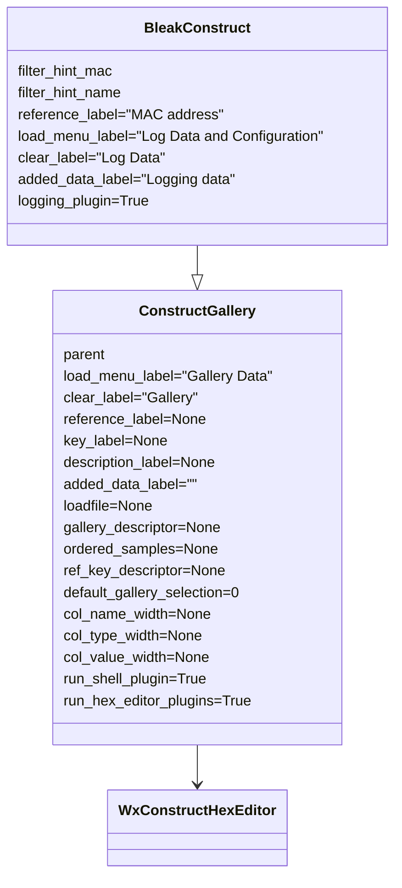
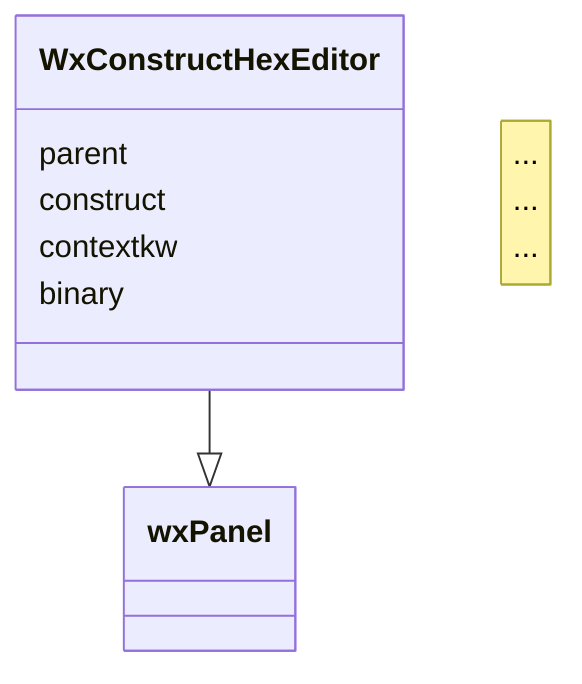

# construct-gallery

__wxPython Widgets extending functionalities of *construct-editor*__

The following Python modules are included:

- `construct_gallery.py`, providing the `ConstructGallery()` class.

  This module implements a GUI editor to parse and build an editable and ordered list of binary data via a gallery of predefined [construct](https://construct.readthedocs.io/en/latest/) data structures. *construct* is a powerful declarative and symmetrical parser and builder for binary data.
  
  The component is based on [wxPython](https://www.wxpython.org/) and [construct-editor](https://github.com/timrid/construct-editor). It relies on the excellent editing widgets provided by the *construct-editor* module and offers a superset of features compared with its standard [GUI](https://github.com/timrid/construct-editor/blob/main/construct_editor/main.py).
  
  This module can be directly used in GUI programs, or can be further extended with `bleak_construct.py`.

- `bleak_construct.py`, providing the `BleakConstruct()` class.

  The component implements a [Bluetooth Low Energy](https://en.wikipedia.org/wiki/Bluetooth_Low_Energy) (BLE) GUI client to log, browse, test and edit [BLE advertisements](https://en.wikipedia.org/wiki/Bluetooth_Low_Energy#Advertising_and_discovery).
  
  This module extends `construct_gallery.py`, offering a skeleton of BLE Advertiser scanner.
  
  [bleak](https://bleak.readthedocs.io/en/latest/) is needed (`pip3 install bleak`)

*construct-gallery* also includes a number of *construct-editor* plugins, which are used by `ConstructGallery()` and `BleakConstruct()`, but they can be separately reused on projects based on *construct-editor*.

- plugins offering additional options for the context menu of the *construct-editor* HexEditorGrid (invoked with the right click of the mouse):
  - `allow_python_expr_plugin.py`
  - `decimal_convert_plugin.py`
  - `string_convert_plugin.py`

- PyShell plugin `pyshell_plugin.py`, adding a button to activate a PyShell frame (PyShell is a GUI-based python shell).

- `wx_logging_plugin.py`, providing a debug GUI panel in background.
- `pyshell_plugin.py`, activating a Python shell button that allows opening an inspector shell, which also includes a special *Help* with related submenu (that can be invoked also via F9). 

## Main functionalities

- Cross-platform GUI
- The GUI includes a BLE control (implemented with buttons) which allows starting and stopping the BLE advertising receiver. Advertisements are logged in their reception sequence, automatically labbelled with the MAC address.
- A filter button can be used to enter a specific MAC address to restrict logging, a portion of it or a sequence of addresses, as well as BLE local names.
- Logged data can be saved to file in [pickle format](https://docs.python.org/3/library/pickle.html). Archives can be subsequently reloaded and appended to the current log. They can also be inspected with `python -mpickle archive-file-name.pickle`.
- Advertisement data are logged in the left panel, shown as hex bytes in the central panel and then parsed to browsable *construct* structures in the right panel.
- The Python error management is wrapped into a GUI panel.
- A Python shell button allows opening an inspector shell, which also provides a special *Help* with related submenu (or by pressing F9).
- All panels allow a context menu (invoked with the right click of the mouse) with a number of special functions.
  - The left log menu panel allows renaming labels and changing MAC address. Also, by double clicking an unused area of the log panel, new frames can be added and then labelled; subsequently, a specific MAC address can be associated. Log elements can be repositioned, or deleted.
  - The hex editor (central panel) allows any kind of copy/paste. Sequences of bytes can be pasted [in a number of different formats](https://github.com/timrid/construct-editor/pull/17#issuecomment-1367582581). Also a special checkbox enables pasting Python expressions. Two debugging tools are also provided (invoked with the right click of the mouse after selecting a sequence of bytes), to convert bytes into a wide set of numeric forms as well as strings; these debug panels can be used to quickly check the most appropriate conversion method for a sequence of bytes.
- When starting the BLE reception, a debug window is opened in background, with the possibility to control the debug level and clear the produced data.

## Setup

### Installation

Check that the [Python](https://www.python.org/) version is 3.6 or higher (`python3 -V`), then install the *sim800l-gsm-module* with the following command:

```shell
python3 -m pip install construct-gallery
```

If the `bleak_construct.py` BLE module is also needed:

```shell
python3 -m pip install bleak
```

Prerequisite component: [construct_editor](https://github.com/timrid/construct-editor). *construct-editor* is automatically installed with the package, while *bleak* requires manual installation.

Alternatively to the above mentioned installation method, the following steps allow installing the latest version from GitHub.

- Optional preliminary configuration (if not already done):

  ```shell
  sudo apt-get update
  sudo apt-get -y upgrade
  sudo add-apt-repository universe # this is only needed if "sudo apt install python3-pip" fails
  sudo apt-get update
  sudo apt install -y python3-pip
  python3 -m pip install --upgrade pip
  sudo apt install -y git
  ```

- Run this command:

```shell
  python3 -m pip install git+https://github.com/Ircama/construct-gallery
```

To uninstall:

```shell
python3 -m pip uninstall -y construct-gallery
```

## Basic use

Run `construct-gallery` from the command line. Follow the API Documentation for the rest.

## API Documentation

### ConstructGallery

```
ConstructGallery(
    frame,
    load_menu_label="Gallery Data",
    clear_label="Gallery",
    reference_label=None,
    key_label=None,
    description_label=None,
    added_data_label="",
    loadfile=None,
    gallery_descriptor=None,
    ordered_samples=None,
    ref_key_descriptor=None,
    default_gallery_selection=0,
    col_name_width=None,
    col_type_width=None,
    col_value_width=None,
    run_shell_plugin=True,
    run_hex_editor_plugins=True
)
```

### BleakConstruct

### Reference (MAC Address), key, description

- A button shows a table allowing to edit MAC addresses and their related Bindkey and description.


### Example of custom population of the gallery frame

The following example shows how to build a full gallery frame, including comments.

The `ConstructGalleryFrame` class is used to build the frame in place of the `wx.Frame` used in the previous example.

`ConstructGalleryFrame` parameters:

- `gallery_selection`: default selection (shall not point to a comment)
- `construct_gallery`: dictionary of the names of the gallery elements (key) and `GalleryItem` (value). If the value is `None`, the element is considered a comment.
- `title`: title of the app
- `size`: tuple defining the default app size (x, y)

`GalleryItem` parameters:

- `construct`: *construct* definition related to the gallery element
- `example_binarys`: dictionary of example names (key) and data (value) related to the gallery element

```python
import construct as cs
import wx
import construct_editor.main as csmain
import construct_editor.gallery as csgallery
# construct definitions
flags_struct = cs.Struct(
    "flag0" / cs.Flag,
    "flag1" / cs.Flag,
    "bit_struct" / cs.BitStruct(
        "bit_flag0" / cs.Flag,
        "bit_flag1" / cs.Flag,
        "bit_flag2" / cs.Flag,
        "bit_flag3" / cs.Flag,
        cs.Padding(4)
    )
)
pass_struct = cs.Struct(
    "value1" / cs.Int8sb,
    "pass" / cs.Pass,
    "value2" / cs.Int8sb,
)
padded_struct = cs.Struct(
    "padded" / cs.Padded(5, cs.Bytes(3)),
    "padding" / cs.Padding(5),
)
# app setup
app = wx.App(False)
frame = csmain.ConstructGalleryFrame(
            None,
            gallery_selection=0,
            
            # Gallery definition
            construct_gallery = {
                "Test: Flag": csgallery.GalleryItem(
                    construct=flags_struct,
                    example_binarys={
                        "1": bytes([0x01, 0x02, 0x40]),
                        "Zeros": bytes(3),
                    },
                ),
                "## miscellaneous ##########################": None,
                "Test: Pass": csgallery.GalleryItem(
                    construct=pass_struct,
                    example_binarys={
                        "Zeros": bytes(2),
                        "1": b"12",
                    },
                ),
                "Test: Padded": csgallery.GalleryItem(
                    construct=padded_struct,
                    example_binarys={
                        "1": bytes([0, 1, 2, 3, 4, 0xF1, 0xF2, 0xF3, 0xF4, 0xF5]),
                        "Zeros": bytes(10),
                    },
                )
            },
            title="Custom sample",
            size=(1000, 500)
)
frame.Show(True)
app.MainLoop()
```

### Class diagram



### construct-editor module



_____________________________________________________________________________________________________________________________

For debugging needs, logs can be set to the maximum level (verbose mode, tracing each request/response) with the following command:

```python
import logging
logging.getLogger().setLevel(5)`
```

---

#### `sim800l = SIM800L(port='/dev/serial0', baudrate=115000, timeout=3.0)`
Class instantiation (using [pySerial](https://github.com/pyserial/pyserial))
- `port`: port name
- `baudrate`: baudrate in bps
- `timeout`: timeout in seconds

---

#### `check_sim()`
Check whether the SIM card has been inserted.
 *return*: `True` if the SIM is inserted, otherwise `False`. `None` in case of module error.

---

#### `command(cmdstr, lines=1, waitfor=500, msgtext=None, flush_input=True)`
Executes an AT command. A newline must be added at the end of the AT command (e.g., `sim800l.command("AT+CCLK?\n", lines=-1)`).
Input is flushed before sending the command (`flush_input=False` disables flushing).
The first newline is discarded (if `lines` != 0).
- `cmdstr`: AT command string
- `lines`: number of expexted lines (see below)
- `waitfor`: number of (milliseconds - 1000) to wait for the returned data; not used if <= 1000 milliseconds.
- `msgtext`: only to be used when sending SMS messages, it includes the SMS text.
- `flush_input`: `True` if residual input is flushed before sending the command. `False` disables flushing.

 *return*: the first line is returned (string); use `check_incoming()` to read the subsequent lines. `None` is returned when no data is received (or module error).

If `lines=0`, terminates just after writing text to the device (no bytes read; no return code, e.g. `None` returned). Note: `check_incoming()` can be subsequently used to read data from the device (see subsequent example).

If `lines`<0 (e.g., `lines=-1`), return the concatenation of all read lines (until pySerial timeout `sim800l.serial_port().timeout`), separating each line by a linefeed.

If `lines`>1 (legacy code), return the concatenation of all read lines, separating each line by a linefeed, discarding null lines and "OK".

Example:

```python
import time
from sim800l import SIM800L

sim800l=SIM800L('/dev/serial0')

# Send data and return the first line
print(sim800l.command("AT+CCLK?\n"))  # ...+CCLK...

# Same as before, but reading both lines
sim800l.command("AT+CCLK?\n", lines=0)  # send AT command without reading data
print("First read line:", sim800l.check_incoming())  # ...+CCLK...
print("Second read line:", sim800l.check_incoming())  # ...'OK'...

# Same as before, but more elaborated
sim800l.command("AT+CCLK?\n", lines=0)
expire = time.monotonic() + 2  # seconds
sequence = ""
s = sim800l.check_incoming()
date = None
while time.monotonic() < expire:
    if s[0] == 'GENERIC' and s[1] and s[1].startswith('+CCLK: "'):
        date = s[1].split('"')[1]
        sequence += "D"
    if s == ('OK', None):
        sequence += "O"
    if sequence == "DO":
        print("Date:", date)
        break
    time.sleep(0.1)
    s = sim800l.check_incoming()

if not date:
    print("Error")
```

---

#### `command_data_ok(cmd, attempts=2)`
Send AT command to the device, read the answer and then check the
existence of the OK message. "cmd" shall not have the ending newline.
- `cmd`: AT command
- `attempts`: number of attempts before returning None or False
 *return*: string in case of successful retrieval; otherwise None if module error or False if missing OK message

---

#### `command_ok(cmd, check_download=False, check_error=False, cmd_timeout=10, attempts=2)`
Send AT command to the device and check that the return sting is OK.
Newline must not be put at the end of the string.
- `cmd`: AT command
- `check_download`: `True` if the “DOWNLOAD” return sting has to be checked
- `check_error`: `True` if the “ERROR” return sting has to be checked
- `cmd_timeout`: timeout in seconds
- `attempts`: number of attempts before returning False
 *return*: `True` = OK received, `False` = OK not received (or module error). If check_error, can return `ERROR`; if check_download, can return `DOWNLOAD`

---

#### `connect_gprs(apn=None)`
Connect to the bearer and get the IP address of the PDP context.
Automatically perform the full PDP context setup.
Reuse the IP session if an IP address is found active.
- `apn`: APN name
 *return*: `False` if error (including module error), otherwise return the IP address (as string)

---

#### `delete_sms(index_id)`
Delete the SMS message referred to the index
- `index_id`: index in the SMS message list starting from 1
 *return*: `None`

---

#### `disconnect_gprs(apn=None)`
Disconnect the bearer.
 *return*: `True` if succesfull, `False` if error

---

#### `get_battery_voltage()`
Return the battery voltage in Volts
 *return*: floating (volts). `None` in case of module error.

Example: 4.158

---

#### `get_ccid()`
Get the ICCID
 *return*: string; `None` in case of module error.

Example: "1122334455667788990f"

---

#### `get_date()`
Return the clock date available in the module.
 *return*: `datetime.datetime`; `None` in case of module error.

Example: "2022-03-09 19:59:31"

---

#### `get_flash_id()`
Get the SIM800 GSM module flash ID
 *return*: string; `None` in case of module error.

Example: "Device Name:SERIAL§FLASH§MTKSIP§6261§SF§24§01"

---

#### `get_hw_revision()`
Get the SIM800 GSM module hw revision
 *return*: string; `None` in case of module error.

Example: "Revision:1418B05SIM800L24"

---

#### `get_imsi()`
Get the IMSI
 *return*: string; `None` in case of module error.

Example: "112233445566778"

---

#### `get_ip()`
Get the IP address of the PDP context
 *return*: valid IP address string if the bearer is connected, otherwise `None` (e.g., module error).

---

#### `get_msgid()`
Return the unsolicited notification of incoming SMS
 *return*: number

---

#### `get_msisdn()`
Get the MSISDN subscriber number
 *return*: string. `None` in case of module error.

---

#### `get_operator()`
Display the current network operator that the handset is currently
registered with.
 *return*: operator string. `None` in case of module error. `False` in case of SIM error.

Example: "Vodafone"

---

#### `get_operator_list()`
Display a full list of network operator names.
 *return*: dictionary of "numeric: "name" fields; None in case of error.

---

#### `get_serial_number()`
Get the SIM800 GSM module serial number
 *return*: string; `None` in case of module error.

Example: "866782042319455"

---

#### `get_service_provider()`
Get the Get Service Provider Name stored inside the SIM
 *return*: string. `None` in case of module error. `False` in case of SIM error.

---

#### `get_signal_strength()`
Get the signal strength
 *return*: number; min = 3, max = 100; `None` in case of module error.

Example: 40.625

---

#### `get_temperature()`
Get the SIM800 GSM module temperature in Celsius degrees
 *return*: string; `None` in case of module error.

Example: "24.21"

---

#### `get_unit_name()`
Get the SIM800 GSM module unit name
 *return*: string (e.g., "SIM800 R14.18"); `None` in case of module error.

---

#### `hard_reset(reset_gpio)`
Perform a hard reset of the SIM800 module through the RESET pin.
This function can only be used on a Raspberry Pi.
- `reset_gpio`: RESET pin
 *return*: `True` if the SIM is active after the reset, otherwise `False`. `None` in case of module error.

---

#### `http(url="...", data="...", apn="...", method="...", use_ssl=False, ua=None, content_type="application/json", allow_redirection=False, http_timeout=10, keep_session=False, attempts=2)`
Run the HTTP GET method or the HTTP PUT method and return retrieved data
Automatically perform the full PDP context setup and close it at the end
(use keep_session=True to keep the IP session active). Reuse the IP
session if an IP address is found active.
Automatically open and close the HTTP session, resetting errors.
- `url`: URL
- `data`: input data used for the PUT method (bytes; e.g., use `data="string".encode()`)
- `apn`: APN name
- `method`: "GET" or "PUT"
- `use_ssl`: `True` if using HTTPS, `False` if using HTTP (see note)
- `ua`: User agent (string); is not set, the SIM800L default user agent is used ("SIMCOM_MODULE").
- `content_type`: (string) set the "Content-Type" field in the HTTP header
- `allow_redirection`: `True` if HTTP redirection is allowed (e.g., if the server sends a redirect code (range 30x), the client will automatically send a new HTTP request)
- `http_timeout`: timeout in seconds
- `keep_session`: `True` to keep the PDP context active at the end
- `attempts`: number of attempts before returning False
 *return*: `False` if error, otherwise the returned data (as string)

While the *Content type* header field can be set, the *Content encoding* is always null.

Sending data with [zlib](https://docs.python.org/3/library/zlib.html) is allowed:

```python
import zlib
body = zlib.compress('hello world'.encode())
sim800l.http("...url...", method="PUT", content_type="zipped", data=body, apn="...")
```

[Note on SSL](https://github.com/ostaquet/Arduino-SIM800L-driver/issues/33#issuecomment-761763635): SIM800L datasheets report that the embedded IP stack only supports SSL2, SSL3 and TLS 1.0. These cryptographic protocols are deprecated for all modern backend servers and the connection will be generally denied by the server, typically leading to SIM800L error 605 or 606 when establishing an HTTPS connection. Some SIM800L datasheets also report support of TLS 1.2 but this does not appear to be true with firmware Revision 1418B05SIM800L24.  So, using `use_ssl=True` is discouraged; setting a Python web server to support the SSL option of a SIM800L client module is not straightforward (it is better to use an [application encryption](https://stackoverflow.com/a/55147077/10598800) instead of SSL). Generally, to be able to connect an HTTPS web service, a separate proxy server is needed (e.g., a custom Python application in cloud), receiving non-SSL HTTP requests from the SIM800L module (possibly with application encryption) and forwarding them to the AWS Lambda HTTP API gateway via HTTPS.

Notice also that, depending on the web server, a specific SSL certificate could be needed for a successful HTTPS connection; the SIM800L module has a limited support of SSL certificates and [installing an additional one](https://stackoverflow.com/questions/36996479/how-sim800-get-ssl-certificate
) is not straightforfard.

An additional problem is related to possible DNS errors when accessing endpoints. Using IP addresses is preferred.

---

#### `internet_sync_time(time_server='193.204.114.232', time_zone_quarter=4, apn=None, http_timeout=10, keep_session=False)`
Connect to the bearer, get the IP address and sync the internal RTC with
the local time returned by the NTP time server (Network Time Protocol).
Automatically perform the full PDP context setup.
Disconnect the bearer at the end (unless keep_session = `True`)
Reuse the IP session if an IP address is found active.
- `time_server`: internet time server (IP address string)
- `time_zone_quarter`: time zone in quarter of hour
- `http_timeout`: timeout in seconds
- `keep_session`: `True` to keep the PDP context active at the end
 *return*: `False` if error, otherwise the returned date (`datetime.datetime`)

Example: "2022-03-09 20:38:09"

---

#### `query_ip_address(url=None, apn=None, http_timeout=10, keep_session=False)`
Connect to the bearer, get the IP address and query an internet domain
name, getting the IP address.
Automatically perform the full PDP context setup.
Disconnect the bearer at the end (unless keep_session = `True`)
Reuse the IP session if an IP address is found active.
- `url`: internet domain name to be queried
- `http_timeout`: timeout in seconds
- `keep_session`: True to keep the PDP context active at the end
 *return*: `False` if error (`None` for module error), otherwise the returned IP address (string)

---

#### `is_registered()`
Check whether the SIM is Registered, home network
 *return*: Truse if registered, otherwise `False`. . `None` in case of module error.

---

#### `read_and_delete_all(index_id=1)`
Read the message at position 1, otherwise delete all SMS messages, regardless the type (read, unread, sent, unsent, received).
If the message is succesfully retrieved, no deletion is done. (Deletion only occurs in case of retrieval error.)
Notice that, while generally message 1 is the first to be read, it might happen that no message at position 1 is available,
while other positions might still include messages; for those cases (missing message at position 1, but other messages
available at other positions), the whole set of messages is deleted.
Use `index_id=0` to delete all messages without trying to retrieve the one at position 1.
 *return*: text of the read message

---

#### `read_next_message(all_msg=False)`
Check messages, read one message and then delete it. This function can be repeatedly called to read all stored/received messages one by one and delete them.
- `all_msg`: `True` if no filter is used (read and unread messages).  Otherwise only the unread messages are returned.
 *return*: retrieved message text (string), otherwise: `None` = no messages to read; `False` = read error (module error)

---

#### `read_sms(index_id)`
Read the SMS message referred to the index_id position
- `index_id`: index in the SMS message list starting from 1
 *return*: `None` if error, otherwise return a tuple including: MSISDN origin number, SMS date string, SMS time string, SMS text

---

#### `send_sms(destno, msgtext)`
Send SMS message
- `destno`: MSISDN destination number
- `msgtext`: Text message
 *return*: `True` if message is sent, otherwise `False`

---

#### `serial_port()`
Return the serial port (for direct debugging)
 *return*:

---

#### `set_date()`
Set the Linux system date with the GSM time
 *return*: date string. `None` in case of module error.

Example: "2022-03-09 20:10:54"

---

#### `setup()`
Run setup strings for the initial configuration of the SIM800 module
 *return*: `True` if setup is successfully completed; `None` in case of module error.

---

#### `sim800l.convert_gsm(string)`
Encode `string` to bytes using the 3GPP TS 23.038 / ETSI GSM 03.38 codec.
- `string`: UTF8 string
 *return*: gsm03.38 bytes

---

#### `sim800l.convert_to_string(buf)`
Decode GSM 03.38 encoded bytes, returning a string.
- `buf`: gsm03.38 bytes
 *return*: UTF8 string

---

#### `check_incoming()`
Internal function, used to check incoming data from the SIM800L module, decoding messages.
It also fires the functions configured with `callback_msg()` and `callback_no_carrier()`.
 *return*: tuple

Return values:
- `('GENERIC', None)`: no data received
- `('GENERIC', data)`: received data is returned (`data` is a string)
- `("HTTPACTION_PUT", False, size)`: invalid HTTP PUT method, with return code different from 200
- `("HTTPACTION_PUT", True, size)`: valid HTTP PUT method; `size` is the number of returned characters
- `("HTTPACTION_GET", False, size)`: invalid HTTP GET method, with return code different from 200
- `("HTTPACTION_GET", True, size)`: valid HTTP GET method; `size` is the number of returned characters
- `("IP", "ip address")`: bearer connected, received IP address
- `("IP", None)`: Disconnected
- `("CMTI", index_id)`: received SMS message with index `index_id`
- `("NOCARRIER", None)`: "NO CARRIER" message detected
- `("RING", None)`: "RING" message detected
- `("OK", None)`: "OK" message detected
- `("DOWNLOAD", None)`: "DOWNLOAD" message detected
- `("ERROR", None)`: "ERROR" message detected
- `("DNS", None, error)`: DNS error message
- `("DNS", dns1, dns2)`: IP address and FQDN retrieved from the DNS
- `("NTP", None, error)`: NTP query error
- `("NTP", date, 0)`: Successful NTP query; `date` is `datetime.datetime` format
- `("COPN", numeric, name)`: Operator number and name
- `("CREG", numeric)`: Registration status
- `("CTZV", tz1, tz2)`: Time Zone
- `("PSUTTZ", year, month, day, hour, minute, second, tz1, tz2)`: time and time zone
- `("DST", dst)`: Daylight Saving Time
- `("RDY", None)`: Power procedure completed
- `("CFUN", numeric)`: Phone functionality indication
- `("PIN", pin)`: PIN
- `("MSG", "Call Ready)`: Call ready
- `("MSG", "SMS Ready)`: SMS ready

Usage sample 1:
```python
if self.check_incoming() != ("OK", None):
    print("Error")
```

---

#### `get_clip()`
(legacy code, not used)

---

#### `set_charset_hex()`
Set the module to the HEX character set (only hexadecimal values from 00 to FF)
 *return*: "OK" if successful, otherwise `None` in case of module error.

---

#### `set_charset_ira()`
Set the module to the International reference alphabet (ITU-T T.50) character set
 *return*: "OK" if successful, otherwise `None` in case of module error.

---

#### `callback_incoming(function)`
(legacy code, not used)
- `function`: Python function with no args

---

#### `callback_msg(function)`
(legacy code)
Configure a callback function, fired when `check_incoming()` receives a message (`+CMTI` returned, indicating new message received).
- `function`: Python function with no args

---

#### `callback_no_carrier(function)`
(legacy code)
Configure a callback function, fired when `check_incoming()` receives "NO CARRIER".
- `function`: Python function with no args

---

## Usage examples

```python 
from sim800l import SIM800L
sim800l = SIM800L('/dev/serial0')
```

#### Return module information
```python
from sim800l import SIM800L

sim800l = SIM800L()
sim800l.setup()

print("Date:",
    sim800l.get_date())
print("Operator:",
    sim800l.get_operator())
print("Service provider:",
    sim800l.get_service_provider())
print("Signal strength:",
    sim800l.get_signal_strength(), "%")
print("Temperature:",
    sim800l.get_temperature(), "degrees")
print("MSISDN:",
    sim800l.get_msisdn())
print("Battery Voltage:",
    sim800l.get_battery_voltage(), "V")
print("IMSI:",
    sim800l.get_imsi())
print("ICCID:",
    sim800l.get_ccid())
print("Unit Name:",
    sim800l.get_unit_name())

if sim800l.is_registered():
    print("SIM is registered.")
else:
    print("SIM NOT registered.")
```

#### Sync time with internet
```python
sim800l.internet_sync_time(apn="...", time_zone_quarter=...)
```

#### Query the DNS for an internet name
```python
sim800l.query_ip_address(url="httpbin.org", apn="...")
```

#### Hard reset
```python
# Note: connect the RST pin with GPIO23 (pin 16 of the Raspberry Pi)
sim800l.hard_reset(23)  # see schematics
```

#### Send SMS
```python
sms="Hello there"
#sim800l.send_sms(dest.no,sms)
sim800l.send_sms('2547xxxxxxxx',sms)
```

#### Read the next SMS message
```python
msg = sim800l.read_next_message(all_msg=True)
```

#### HTTP GET samples
```python
print(sim800l.http("httpbin.org/ip", method="GET", apn="..."))
print(sim800l.http("httpbin.org/get", method="GET", use_ssl=False, apn="..."))  # HTTP
print(sim800l.http("httpbin.org/get", method="GET", use_ssl=True, apn="..."))  # HTTPS
```

Note: time ago `httpbin.org` succeeded with HTTPS because supporting an old SSL version. Curently the test fails with HTTPS.

#### HTTP PUT sample
```python
print(sim800l.http("httpbin.org/post", data='{"name","abc"}'.encode(), method="PUT", apn="..."))  # HTTPS
print(sim800l.http("httpbin.org/post", data='{"name","abc"}'.encode(), method="PUT", use_ssl=False, apn="..."))  # HTTP
```

#### Read the n-th SMS
```python
Read the SMS indexed by the index_id value [ref. also check_incoming()]
index_id=...  # e.g., 1
sim800l.read_sms(index_id)
```

#### Callback action
(legacy code)
```python
def print_delete():
    # Assuming the SIM has no SMS initially
    sms = sim800l.read_sms(1)
    print(sms)
    sim800l.delete_sms(1)

sim800l.callback_msg(print_delete)

while `True`:
    sim800l.check_incoming()
```
